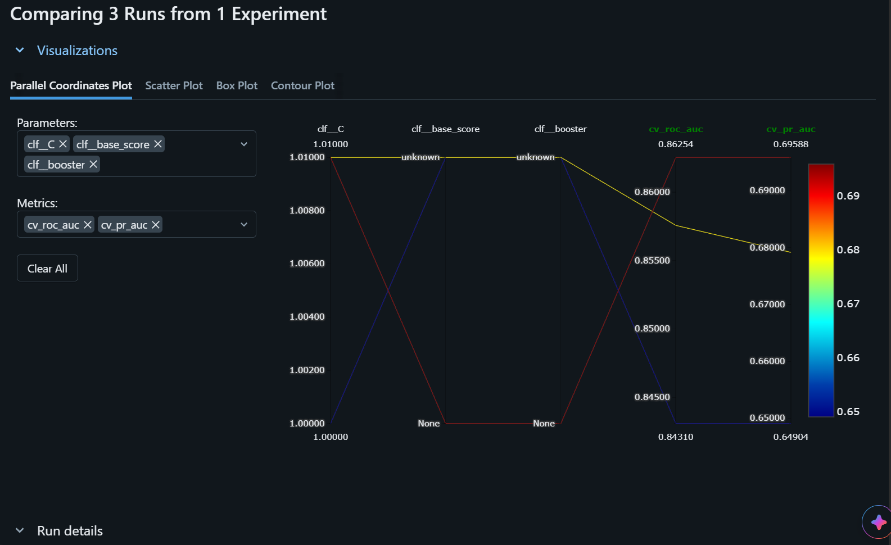
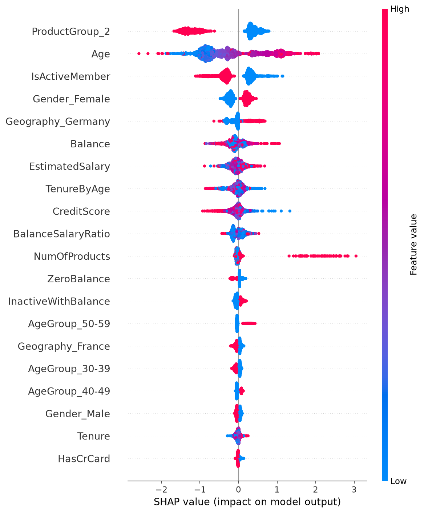
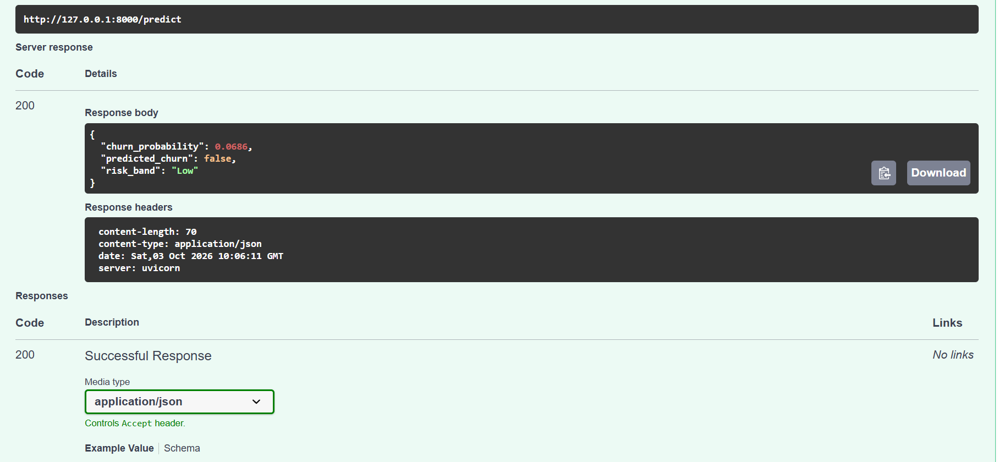
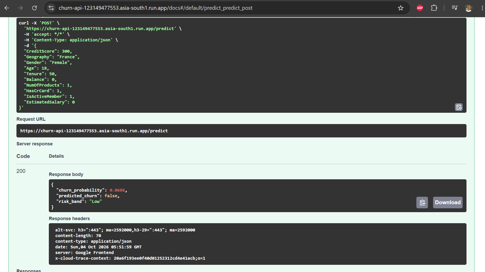
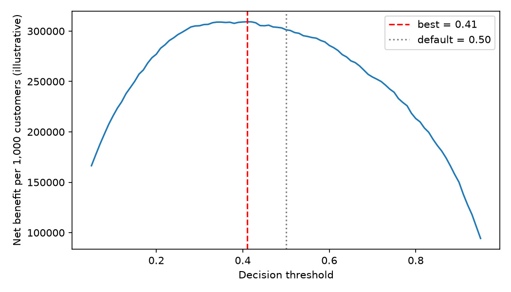

# Customer Churn Prediction and Retention Analytics


An end-to-end ML project that predicts which bank customers are likely to leave and turns the predictions into a retention recommendation. It covers feature engineering in PySpark, model comparison with experiment tracking, explainability, a fairness check, and a tested, containerised prediction API with CI.

## Business problem
Retaining a customer is usually cheaper than acquiring one. The goal is to rank customers by churn risk so a retention team can contact the riskiest ones first.

## Dataset
Kaggle "Bank Customer Churn Prediction" (`Churn_Modelling.csv`): 10,000 customers, 20.4% churned. Download it into `data/` (the folder is gitignored).

## Results
Stratified 5-fold CV on an 80% training split, then a single evaluation on a 20% held-out test set (2,000 customers).

| Model | CV ROC-AUC | CV PR-AUC | Test ROC-AUC | Test PR-AUC | Test recall |
|---|---|---|---|---|---|
| Logistic Regression | 0.843 | 0.649 | 0.846 | 0.677 | 0.735 |
| Random Forest | 0.858 | 0.679 | 0.860 | 0.705 | 0.727 |
| **XGBoost** | **0.863** | **0.696** | **0.863** | **0.713** | 0.732 |

The best model was chosen on CV PR-AUC, not on the test set. Class imbalance (about 4:1) is handled with class weights, and PR-AUC and recall are reported instead of accuracy.



## Key findings
- **Age** is the strongest driver: churn is 7.5% under 30, 34.0% for ages 41-50 and 56.2% for ages 51-60.
- **Product count** is non-linear: customers with 2 products churn least, while 3+ products churn heavily (a small segment).
- Inactive members, customers in Germany, and female customers have higher churn.
- SHAP confirms the same top drivers: product group, age, activity status, gender, geography and balance.



## Business impact (on the held-out test set)
Contacting the riskiest 20% of customers reaches 62.2% of churners (3.1x lift over random targeting); the top 10% reaches 41.5% (4.2x).

**Recommendation:** target the top 20% by risk score, prioritising customers aged 40-60, inactive members with a balance, and Germany. Investigate product or service issues for 3+ product customers. These are associations, not causal effects, so any retention offer should be A/B tested before impact is claimed.

## Fairness check
Precision is similar across gender and country groups (about 0.50-0.54), but flag rates and recall differ, mainly because base churn rates differ (for example 30% in Germany versus 17% in France and Spain). Gender is a model input; a production system would need a review of whether to use it. Group sizes are 475-1,070 customers, so some gaps may be noise.

## Pipeline
1. `src/features.py`: PySpark feature engineering (balance-to-salary ratio, zero-balance flag, age and product groups, inactive-with-balance flag), saved as Parquet.
2. `src/train.py`: scikit-learn pipelines (scaling and encoding fitted inside CV folds, so there is no leakage), three models, MLflow tracking.
3. `src/explain.py`: SHAP, fairness table and lift analysis.
4. `src/api.py`: FastAPI service with input validation and a `/predict` endpoint returning probability and risk band.
5. `tests/`: pytest tests for the API.
6. `Dockerfile` and `.github/workflows/ci.yml`: the CI runs tests, then builds and smoke-tests the Docker image on every push.



## Run it locally
```bash
python -m venv venv
venv\Scripts\activate            # Mac/Linux: source venv/bin/activate
pip install -r requirements.txt
python src/features.py
python src/train.py
python src/explain.py
mlflow ui                        # experiment comparison at http://127.0.0.1:5000
pytest -q
uvicorn api:app --app-dir src    # docs at http://127.0.0.1:8000/docs
```
Docker: `docker build -t churn-api . && docker run -p 8000:8000 churn-api`

## Limitations
- The dataset has 10,000 rows. The features are written in PySpark so they scale, but Spark is not needed at this size.
- The API reimplements the feature logic in pandas for single-row serving, so the two copies must be kept in sync.
- The model is trained once, with no automated retraining.
- Results come from one dataset and one train/test split.

## Tech stack
Python, PySpark, pandas, scikit-learn, XGBoost, SHAP, MLflow, FastAPI, pytest, Docker, GitHub Actions

   ## Deployment
   The API is containerised and deployed on Google Cloud Run (asia-south1).
   Live docs: <your service URL>/docs

   

   ## Decision threshold
The default 0.5 cut-off is not necessarily the best business choice. I tuned the threshold with a cost/benefit analysis on out-of-fold training predictions (so the test set did not influence the choice), using illustrative assumptions: customer value 10,000, offer cost 500, and a 30% save rate among contacted churners.

| | Default 0.50 | Tuned 0.41 |
|---|---|---|
| Customers flagged | 28.4% | 35.0% |
| Recall | 0.732 | 0.803 |
| Precision | 0.524 | 0.466 |

Under these assumptions the tuned threshold gives about 3% higher net benefit on the held-out test set. The best threshold is highly sensitive to the offer cost (0.25 at a cost of 250, 0.41 at 500, 0.61 at 1,000, 0.86 at 2,000), so real campaign costs and customer values would be needed before using it in production. The chosen threshold is saved in `models/threshold.json`; the deployed API still uses the default 0.5.


